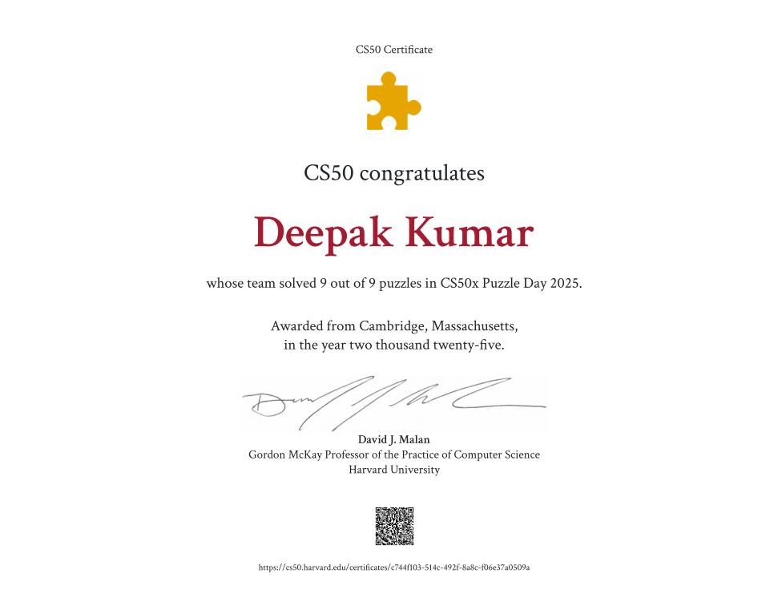
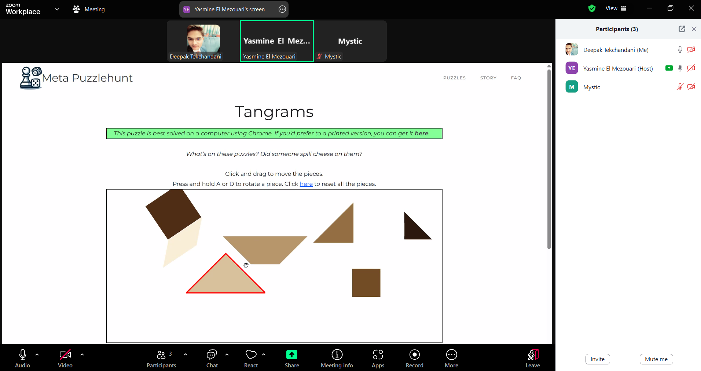

# 🧠 CS50x PUZZLE DAY 2025 – HARVARD UNIVERSITY

## 🚀 My Journey in **Harvard's CS50x Puzzle Day 2025**

Welcome to my CS50x Puzzle Day 2025 repository! This space showcases my participation, achievements, and reflections on one of the most intellectually stimulating events hosted globally by **Harvard University**.

🔗 **Official Event Link:** [cs50.harvard.edu/x/puzzles](https://cs50.harvard.edu/x/puzzles)

---

## 📅 Event Details

- 🗓️ **Date:** April 4–7, 2025  
- 🏛️ **Organizer:** Harvard University (CS50 Team led by David J. Malan)  
- 🧠 **Challenge:** Logic, puzzles, creative thinking, and collaborative problem-solving  
- 🥇 **Outcome:** All puzzles solved successfully – Certificate earned!

---

## 🧩 Team: *CACHE ME IF YOU CAN*

| Name                     | Country        | LinkedIn |
|--------------------------|----------------|----------|
| **Deepak Kumar**          | 🇵🇰 Pakistan    | [Deepak Kumar.](https://www.linkedin.com/in/deepak-kumar-4aa25219a/) |
| **Yasmine El Mezouari**        | Morocco    | [Yasmine El Mezouari.](https://www.linkedin.com/in/yasmine-el-mezouari/) |
| **Neeraj Kumar**     | 🇵🇰 Pakistan      | [Neeraj Kumar.](https://www.linkedin.com/in/neeraj-kumar-438307291/) |
| **Anjalee Ramwani**| 🇵🇰 Pakistan | [Anjalee Ramwani](https://www.linkedin.com/in/anjalee-ramwani/) |
| **Waqas Ali**| 🇵🇰 Pakistan | [Waqas Ali](https://www.linkedin.com/in/waqas-ali-143a1597/) |
| **Priyansh Kumar**|  India | [Priyansh Kumar](https://www.linkedin.com/in/priyanshkumar18/) |

✅ **Puzzle Progress:** *9 out of 9* puzzles solved – Mission accomplished! 🎉

---

## 🏅 Certificate of Participation

  

🔗 **[View Full Certificate (PDF)](https://certificates.cs50.io/c744f103-514c-492f-8a8c-f06e37a0509a.pdf?size=letter)**

---

## 💡 Lessons Learned

Here are some key takeaways from the event that left a lasting impact:

- 🤝 **Teamwork** – Shared minds solve stronger  
- 🌍 **Global Collaboration** – Diverse thinking drives innovation  
- 🧩 **Puzzle Power** – Logic and patience go hand-in-hand  
- 🚀 **Growth Mindset** – Mistakes helped us learn and adapt  
- 🎨 **Creative Problem-Solving** – Sometimes, thinking *outside the box* is the only way

---

## 📸 Glimpses of Our Team Collaboration

  

---

## 🔗 Shared on LinkedIn

I shared my CS50x Puzzle Day 2025 experience on LinkedIn!  
📢 [Read the Post Here](https://www.linkedin.com/feed/update/urn:li:activity:7316847758076731392/)

---

## 🔥 Highlight Reel

💼 Represented Pakistan globally 🌍  
✅ Solved all puzzles with the team  
🏅 Earned an official certificate from **Harvard**  
🧠 Boosted creative and analytical problem-solving  
🌐 Connected with international minds  

---

## 🧩 CS50x Puzzle Day: More Than Just a Game!

> *"CS50x Puzzle Day isn’t just about solving logic problems — it’s about breaking barriers, building teams, and celebrating global brainpower."*

---

## 🙌 Thanks, CS50 Team!

A big shoutout to **David J. Malan** and the CS50x team for organizing such a fun and mentally stimulating event. Looking forward to next year already! 💖

---

### 📬 Let’s Connect!

- 🔗 [GitHub – Deepak Kumar](https://github.com/Deepak-tekchandani)  
- 🔗 [LinkedIn – Deepak Kumar](https://www.linkedin.com/in/deepak-kumar-4aa25219a/)

---
